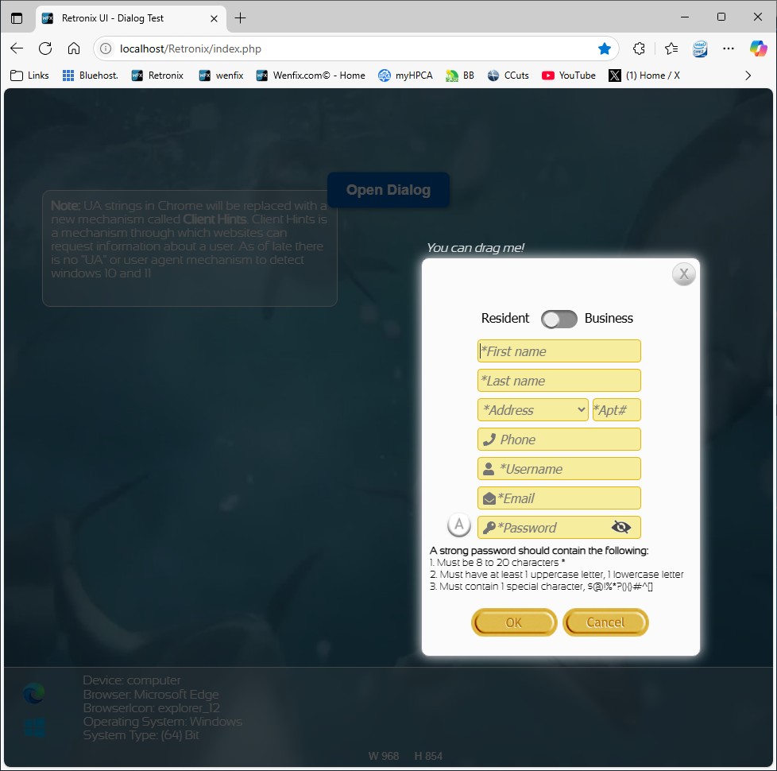

# 🕹️ Retro UI Kit

A handcrafted retro-modern UI system built with sprite buttons, blur windows, animated placeholders, and system-aware logic. Designed for web developers who want maximum control over their interfaces — no Bootstrap bloat, just raw creative power.

---

## 🚀 Features

- 🎨 **Sprite-based Buttons** with hover/press states
- 🧊 **Glass Blur Panels** for dialogs and alerts
- 🛂 **System Detection** via PHP and JavaScript
- 🔐 **Password Strength Meter** with animations and color gradients
- 🎚️ **Form Switcher** toggles Resident / Business inputs
- 🛠️ **Fully AJAX-powered Forms** with PHP server validation
- 🧪 **Easter Egg Testing Triggers** for rapid dev fill-ins

---

## 📁 File Structure

